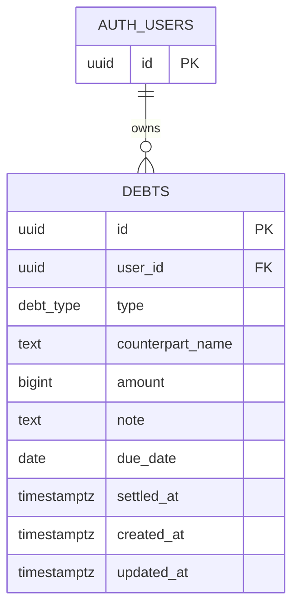

# ERD — Kasbon

## 1. Entity relationship



`auth.users` is owned by Supabase Auth. The application creates only `public.debts` and references `auth.users(id)`; it does not duplicate credentials or user profile data.

## 2. Table: `public.debts`

| Column | Type | Null? | Rule / meaning |
|---|---|---:|---|
| `id` | `uuid` | No | Primary key; generated by `gen_random_uuid()` |
| `user_id` | `uuid` | No | FK to `auth.users(id)`; owner set from the authenticated session |
| `type` | `public.debt_type` | No | `owed_to_me` or `i_owe` |
| `counterpart_name` | `text` | No | Trimmed, non-empty person name |
| `amount` | `bigint` | No | Positive integer Rupiah amount; no decimals. API serializes it as a decimal string to preserve precision. |
| `note` | `text` | Yes | Optional; maximum 200 characters |
| `due_date` | `date` | Yes | Form “Tanggal”; MVP requires it in UI and defaults to today |
| `settled_at` | `timestamptz` | Yes | `NULL` means unsettled; non-null means settled |
| `created_at` | `timestamptz` | No | Created timestamp in UTC |
| `updated_at` | `timestamptz` | No | Last updated timestamp in UTC |

## 3. Migration SQL

Save as `supabase/migrations/0001_create_debts.sql`.

```sql
create type public.debt_type as enum ('owed_to_me', 'i_owe');

create table public.debts (
  id uuid primary key default gen_random_uuid(),
  user_id uuid not null references auth.users(id) on delete cascade,
  type public.debt_type not null,
  counterpart_name text not null check (length(btrim(counterpart_name)) > 0),
  amount bigint not null check (amount > 0),
  note text null check (note is null or char_length(note) <= 200),
  due_date date null,
  settled_at timestamptz null,
  created_at timestamptz not null default now(),
  updated_at timestamptz not null default now()
);

create index debts_user_created_at_idx
  on public.debts (user_id, created_at desc);
create index debts_user_settled_at_idx
  on public.debts (user_id, settled_at);
create index debts_user_type_idx
  on public.debts (user_id, type);

alter table public.debts enable row level security;

create policy "Users can read their own debts"
  on public.debts for select to authenticated
  using ((select auth.uid()) = user_id);

create policy "Users can create their own debts"
  on public.debts for insert to authenticated
  with check ((select auth.uid()) = user_id);

create policy "Users can update their own debts"
  on public.debts for update to authenticated
  using ((select auth.uid()) = user_id)
  with check ((select auth.uid()) = user_id);

create policy "Users can delete their own debts"
  on public.debts for delete to authenticated
  using ((select auth.uid()) = user_id);

grant usage on type public.debt_type to authenticated;
grant select, insert, update, delete on public.debts to authenticated;

create or replace function public.set_debts_updated_at()
returns trigger
language plpgsql
as $$
begin
  new.updated_at = now();
  return new;
end;
$$;

create trigger debts_set_updated_at
  before update on public.debts
  for each row execute function public.set_debts_updated_at();
```

## 4. Security notes

- RLS is the final row-level boundary. API auth checks provide clear HTTP behavior but do not replace RLS.
- Never use a service-role key for user-scoped CRUD: service-role requests bypass RLS.
- Do not accept `user_id` from POST/PATCH payloads. Set it from the verified Auth session and let the insert policy check it.
- In a cross-user REST test, authenticate as user A using the public/anon key. A `SELECT` should return no user B rows; an insert claiming B's ID should be denied; update/delete targeting B rows should affect zero rows.
- Keep policy names and migration source controlled. Verify behavior in a real Supabase project, not only by reading the SQL.

## 5. Summary queries

Calculate outstanding totals only for unsettled rows:

```sql
select
  coalesce(sum(amount) filter (where type = 'owed_to_me'), 0) as owed_to_me,
  coalesce(sum(amount) filter (where type = 'i_owe'), 0) as i_owe
from public.debts
where user_id = auth.uid()
  and settled_at is null;
```

RLS scopes the visible rows, so a user-scoped query may omit a manually supplied `user_id` filter. PostgreSQL `sum(bigint)` returns `numeric`; convert aggregate totals to decimal strings for JSON. If aggregating in TypeScript, use `BigInt` and serialize totals as strings.
